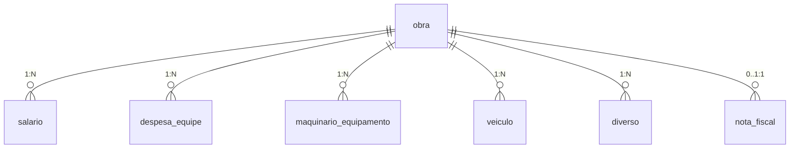

# Web Application Document - Projeto Individual - Módulo 2 - Inteli

## Finance Manager 

#### Danilo de Castro Neto

## Sumário

1. [Introdução](#c1)  
2. [Visão Geral da Aplicação Web](#c2)  
3. [Projeto Técnico da Aplicação Web](#c3)  
4. [Desenvolvimento da Aplicação Web](#c4)  
5. [Referências](#c5)  

 

## 1. Introdução 

* O Finance Manager é uma plataforma desenvolvida para a Fortal, uma empresa de engenharia ambiental, com a proposata de sofisticar o sistema de rateio financeiro em vigor. Atualmente esse processo é feito a partir de planilhas do Excel, o que resulta em limitações na análise dos custos da empresa. A Fortal trabalha com uma grande variedade de contratos públicos e privados no setor de engenharia e serviços ambientais, por isso, cada contrato de serviço possui um rateio finnaceiro individual, e caso seja necessário, o rateio é subdividido pelas regiões de atuação de um mesmo contrato. O motivo dessa divisão é para que o controle financeiro seja mais nichado e eficiente. Tendo em vista a diversidade regional e o volume de serviços executados simultaneamete, se fez essencial o desenvolvimento de uma plataforma organizada e visualmente clara, que sirva como uma ferramenta de  apaio para melhorar a tomada de decisões por parte do diretor da empresa. A plataforma receberá um banco de dados que foi modelado a partir de uma análise das planilhas contábeis da Fortal. A partir disso, o sistema organizará os gastos das obras em diferentes categorias (ex: mão de obra, aluguel de equipamentos, despesas da equipe, insumos, etc.) e essas categorias serão divididas em subcategorias que se relacionam com cada uma delas. Essa categorização fará com que o sistema financeiro seja ainda mais detalhado e completo. A solução também contempalrá a porcentagem que cada tipo de gasto representa dentro de uma obra ou serviço, que poderá ser vizualizada por meio de gráficos, de modo a tornar a experiência mais visual. Além disso, o Finance Manager devará calcular e apresentar o BDI (índice que representa a relação entre faturamento e gastos), que é um dado essencial para o estudo da rentabilidade dos centros de custo. Por fim, para que o faturamento dos contratos seja calculado, o usuário deverá adicionar ou remover as notas fiscais que forem emitidas pelos clientes da empresa.  *
 
---

## 2. Visão Geral da Aplicação Web

### 2.1. Personas 

    <strong style="font-size: 18px;"></strong> 
 
  

### 2.2. User Stories 

##### US1 
* "Como administrador da empresa, posso acessar qual porcentagem uma categoria de gastos está representando no balanço comercial de alguma obra em andamento." 
* A US1 atende ao critério INVEST porque descreve uma funcionalidade que é independente, podendo ser desenvolvida sem depender diretamente de outras. Ela é negociável, permitindo que ajustes sejam feitos na forma como os dados são apresentados. Ela traz um valor claro para o administrador, pois facilita o acompanhamento financeiro das obras. É estimável, já que o esforço necessário para sua implementação podem ser calculado com base nos requisitos apresentados. É  pequena o suficiente para ser entregue em um prazo relativamente curto e é testável pois é possível analisar se o administrador consegue acessar corretamente a porcentagem dos gastos por categoria.
##### US2 
* "Como administrador da empresa, devo ser capaz de adicionar os ganhos por notas ficais referente aquele centro de custo." 
* A US2 atende ao critério INVEST porque descreve uma tarefa que é independente, permitindo que a adição de ganhos por notas fiscais ocorra sem depender de outras partes da plataforma. Ela é negociável, já que mudanças podem ser ajustadas conforme necessário. Além disso, é valiosa, pois adiciona um dado importante para os cálculos financeiro. É estimável, pois é possível calcular o esforço necessário para implementar esse recurso. A user story é pequena, focando apenas na ação de adicionar ganhos, e também é testável, já que podemos validar se as notas fiscais estão sendo corretamente associadas aos centros de custo.
##### US3 
* "Como administrador da empresa, devo ser capaz de analisar a rentabilidade da obra a partir do índice de BDI que será calculado dentro da aplicação." 
* A US3 atende em grande parte ao critério INVEST, pois descreve uma funcionalidade que traz um valor claro para o administrador, focando na análise da rentabilidade da obra através do índice de BDI. Mesmo que dependa de outras funcionalidades para obter os dados necessários ao cálculo do BDI(no caso o valor total gasto), ela ainda é negociável, permitindo ajustes na forma como o cálculo e a apresentação são feitos. Também é bastante valiosa já oferece uma informação financeira de altíssimo grau de importância. é estimável, já que o esforço para implementação pode ser calculado levando em conta as integrações necessárias. Por fim é pequena, com um escopo focado na análise de um único índice que precisa de poucas informações, e é testável, podendo ser validada ao comparar o cálculo automático com exemplos reais no histórico da empresa.

---

## 3. Projeto da Aplicação Web

### 3.1. Modelagem do banco de dados  (Semana 3)

##### Visão maximalista do diagrama do BD

##### Entidades e Relacionamentos:

##### Obra 
Representam 
- nome
- total_despesa
- total_faturamento

**Relacionamentos:**
- Cada obra está relacionada com cada uma das 5 categorias de gastos (salario, veiculos, maquinario, despesa_equipe, diversos) e com a tabela de lançamento de notas fiscais (nota_fiscal)

---

#### salario (`salario`)
Representam os principais gastos com salário da empresa:
- descricao
- valor
- id_obra

**Relacionamentos:**
- Cada salário pertence a uma única obra.

---

#### despesa_equipe (`despesa_equipe`)
Guardam informações sobre despesas de custo da equipe:
- descricao
- valor
- id_obra

**Relacionamentos:**
- Cada despesa da equipe pertence a uma obra.

---

#### maquinario_equipamento (`maquinario_equipamento`)
Guardam informações sobre gastos com máquinas e equipamentos :
- descricao
- valor
- id_obra

**Relacionamentos:**
- Cada gasto com maquinário pertence a uma obra.

---

#### veiculos (`veiculos`)
Representam gastos com os veiculos da frota da empresa:
- descricao
- valor
- id_obra

**Relacionamentos:**
- Cada gasto com veículo pertence a uma única obra.

---

#### diverso (`diverso`)
Representa gastos adicionais que não se encaixam dentro das demais categorias:
- descricao
- valor
- id_obra
**Relacionamentos:**
- Cada gasto diverso está relacionado com uma única obra.

---

#### diverso (`diverso`)
Representa as notas fiscais que compõe o faturamento de uma obra da empresa:
- numero
- valor_bruto
- valor_liquido
- data_emissao
- id_obra

**Relacionamentos:**
- Cada nota fiscal está relacionada com uma única obra.

  Diagrama do banco de dados completo: 
   
  Fonte: Desenvolvido por Danilo de Castro

#### Modelo físico com o Schema do BD
📥 [Schema SQL completo](../scripts/init.sql)

### 3.1.1 BD e Models (Semana 5)
*Descreva aqui os Models implementados no sistema web*

### 3.2. Arquitetura (Semana 5)

*Posicione aqui o diagrama de arquitetura da sua solução de aplicação web. Atualize sempre que necessário.*

**Instruções para criação do diagrama de arquitetura**  
- **Model**: A camada que lida com a lógica de negócios e interage com o banco de dados.
- **View**: A camada responsável pela interface de usuário.
- **Controller**: A camada que recebe as requisições, processa as ações e atualiza o modelo e a visualização.
  
*Adicione as setas e explicações sobre como os dados fluem entre o Model, Controller e View.*

### 3.3. Wireframes (Semana 03)

####  Home
(apoia o cumprimento das US1, US2 e US3): Esta tela inicial exibe uma imagem destacada e uma galeria de obras registradas no sistema, funcionando como um ponto de entrada para as funcionalidades principais. Ao selecionar uma obra, o usuário é direcionado à visualização individual com acesso detalhado aos dados financeiros, o que viabiliza a navegação necessária para as análises de gasto, faturamento e BDI previstas nas user stories.

  Tela inicial: 
   
  Fonte: Desenvolvido por Danilo de Castro

####  Obra
(atende às US1, US2 e US3): Esta tela apresenta os dados específicos de uma obra individual, incluindo imagem, valor total de gastos, faturamento e BDI, além de listar os gastos por categoria com descrição, valor, percentual e gráfico. Com isso, ela viabiliza a visualização da proporção de gastos por categoria (US1), considera os ganhos informados por notas fiscais (US2) e exibe o cálculo do BDI, permitindo a análise da rentabilidade da obra (US3).

  Tela de rateio da obra: 
   
  Fonte: Desenvolvido por Danilo de Castro

####  Notas fiscais
(atende à US2): Esta tela permite ao administrador adicionar e remover notas fiscais associadas a centros de custo, listando todas as informações relevantes em formato de tabela. O botão “Adicionar” possibilita registrar novos ganhos, sendo essencial para o cálculo do faturamento da obra, conforme solicitado pela user story sobre controle de notas fiscais (US2).

  Tela de notas fiscais: 
   
  Fonte: Desenvolvido por Danilo de Castro

####  Dashboard
(atende às US1, US2 e US3): Esta tela apresenta uma visão consolidada do desempenho financeiro da empresa, exibindo os valores de gasto total, faturamento total e BDI total, acompanhados por gráficos que representam visualmente a composição desses dados por categoria. Ela permite ao administrador visualizar a porcentagem que cada tipo de gasto representa no balanço da obra (US1), considerar os ganhos provenientes das notas fiscais (US2) e analisar a rentabilidade da operação por meio do índice de BDI (US3).

  Tela de dashboard: 
   
  Fonte: Desenvolvido por Danilo de Castro

### 3.4. Guia de estilos (Semana 05)

*Descreva aqui orientações gerais para o leitor sobre como utilizar os componentes do guia de estilos de sua solução.*

### 3.5. Protótipo de alta fidelidade (Semana 05)

*Posicione aqui algumas imagens demonstrativas de seu protótipo de alta fidelidade e o link para acesso ao protótipo completo (mantenha o link sempre público para visualização).*

### 3.6. WebAPI e endpoints (Semana 05)

*Utilize um link para outra página de documentação contendo a descrição completa de cada endpoint. Ou descreva aqui cada endpoint criado para seu sistema.*  

### 3.7 Interface e Navegação (Semana 07)

*Descreva e ilustre aqui o desenvolvimento do frontend do sistema web, explicando brevemente o que foi entregue em termos de código e sistema. Utilize prints de tela para ilustrar.*

---

## 4. Desenvolvimento da Aplicação Web (Semana 8)

### 4.1 Demonstração do Sistema Web (Semana 8)

*VIDEO: Insira o link do vídeo demonstrativo nesta seção*
*Descreva e ilustre aqui o desenvolvimento do sistema web completo, explicando brevemente o que foi entregue em termos de código e sistema. Utilize prints de tela para ilustrar.*

### 4.2 Conclusões e Trabalhos Futuros (Semana 8)

*Indique pontos fortes e pontos a melhorar de maneira geral.*
*Relacione também quaisquer outras ideias que você tenha para melhorias futuras.*

## 5. Referências

_Incluir as principais referências de seu projeto, para que seu parceiro possa consultar caso ele se interessar em aprofundar. Um exemplo de referência de livro e de site:_ 

---
---
